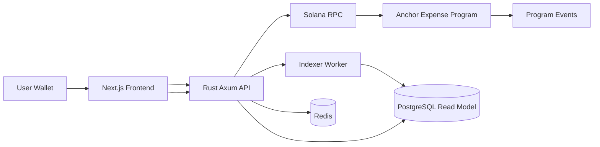
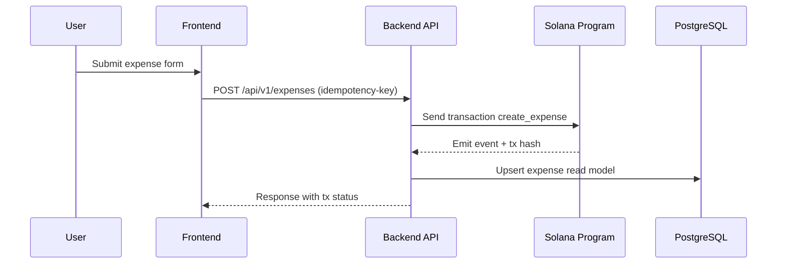

# Diagrams

## 1) High-level flow (Mermaid)

```mermaid
flowchart LR
    U[User Wallet] --> FE[Next.js Frontend]
    FE --> API[Rust Axum API]
    API --> RPC[Solana RPC]
    RPC --> SC[Anchor Expense Program]
    SC --> EV[Program Events]
    API --> IDX[Indexer Worker]
    IDX --> DB[(PostgreSQL Read Model)]
    API --> REDIS[(Redis)]
    FE --> API
    API --> DB
```

## 2) Sequence create expense

```mermaid
sequenceDiagram
    participant U as User
    participant FE as Frontend
    participant API as Backend API
    participant SC as Solana Program
    participant DB as PostgreSQL

    U->>FE: Submit expense form
    FE->>API: POST /api/v1/expenses (idempotency-key)
    API->>SC: Send transaction create_expense
    SC-->>API: Emit event + tx hash
    API->>DB: Upsert expense read model
    API-->>FE: Response with tx status
```
